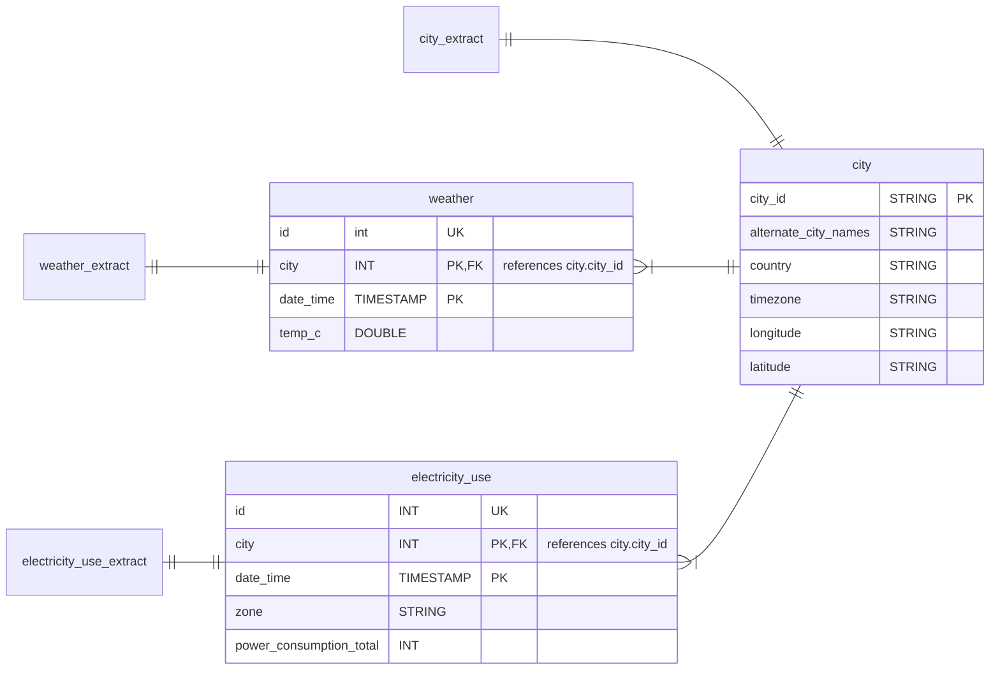
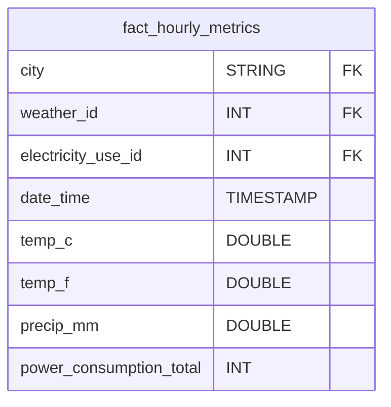

## Utility Demand Pipeline
What started as a passion project is now an end-to-end pipeline that ingests weather and power grid data and overlays it in a warehouse for downstream analytics. It's written in Python/PySpark and is platform agnostic (can run on any cloud or locally), portable (utilizes containers for rapid setup), and scalable (we can easily add more data sources and schemas without refactoring).

## Setup
This application has been containarized and all local setup automated so there's not much legwork to be done.

- First install [Docker Desktop](https://www.docker.com/products/docker-desktop/) and `just` via `brew install just`

- Then clone this repository, open it, and run the command `just run`

And that's it! You can now perform testing within the container and manage versioning on your host machine just as you normally would.

_Note that the Dockerfile used to build the image has been left in this repository so you use it to build your own image or understand requirements._

## Project Overview
There are currently four pipelines contained in this project: city, weather, electricity use, and one to move data to the warehouse. The city data is ingested from a file and acts as a central table that our metrics (weather and electricity use) refer to. The weather and electricity use data are both extracted from APIs with a temporal granularity of hourly. The populate_fact_hourly_metrics job then denormalizes the data and moves it to the utilities warehouse to support live analytics dashboards.
Each pipeline is described in more detail under ./docs/ .

### Dashboard Example
We can connect to Tableau Cloud directly within Databricks using our compute resource.

## Data Lakehouse ERD
***Not every field is mentioned in this diagram.***

The data warehouse does not exist as a completely separate entity. Instead, we treat our city, electricity_use, and weather tables as dimensions surrounding a fact_hourly_metrics table that lives in a different schema. As this project grows we may create a separate location for our dimension tables.

## Future Enhancements
- Improved logging
- Update city table data types
- Integrated testing
- CI/CD automations
